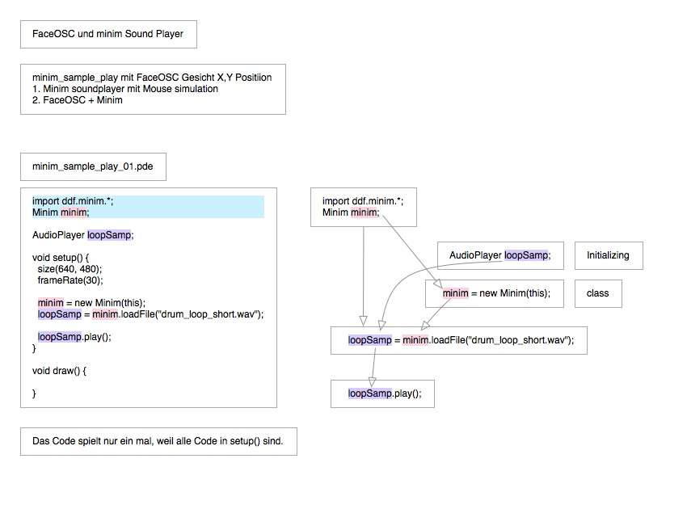
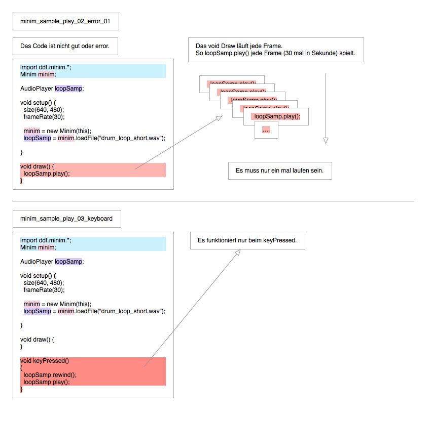
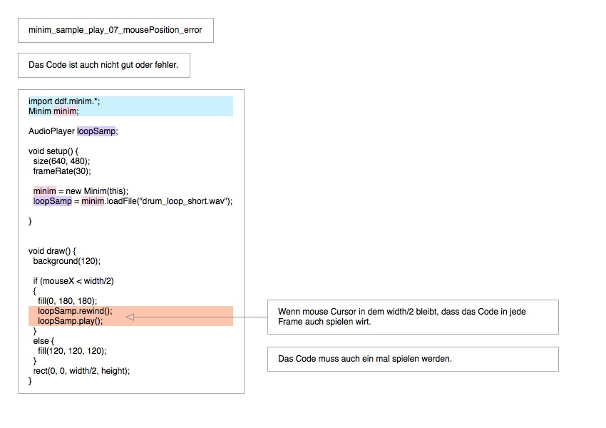
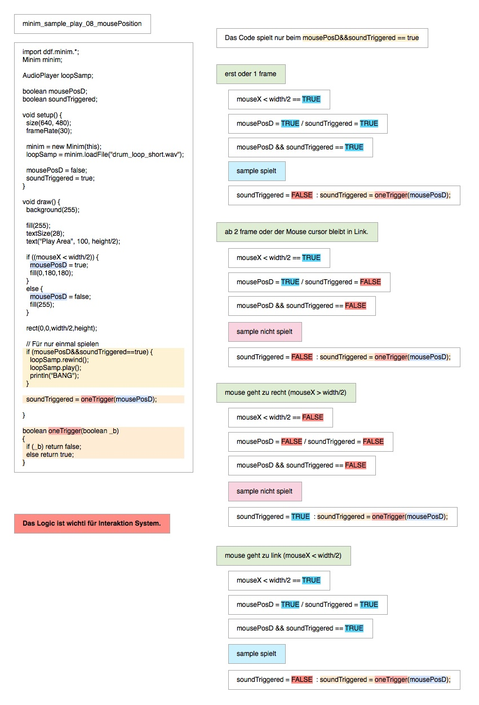
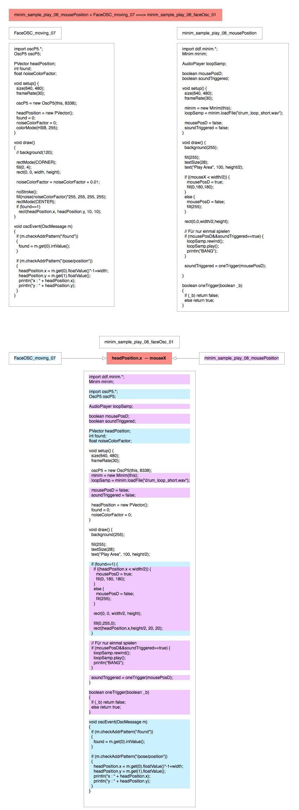

# Installation Laboratory : 03.04.2013

## Processing Code
<http://code.compartmental.net/minim-beta/javadoc/>

**minim Sound Spielt mit Mouse**

**minim_sample_play_08_mousePosition + minim_sample_play_08_faceOsc_01**
Die zwei Code wirt mischungen.
